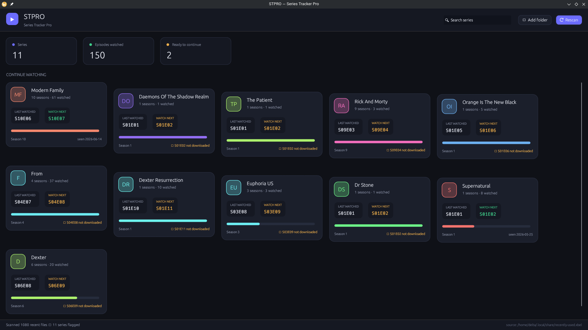

# STPRO — Series Tracker Pro

A native Linux desktop app (Rust + [egui](https://github.com/emilk/egui)) that reads
your **recently-used files**, flags everything named with a `S00E00` episode pattern
(case-insensitive), and turns it into a "continue watching" board:

- which **series** you're working through,
- the **last episode** you watched (most recently opened), and
- the **episode to watch next** — and whether you already have it downloaded.

No accounts, no internet, no database. It just reads what you've already opened.



## How it works

1. Parses `~/.local/share/recently-used.xbel` — the freedesktop "recent files"
   database that file managers and media players write to.
2. For each entry it strips the extension and matches the stem against
   `(?i)s(\d{1,3})[\s._-]*e(\d{1,3})`, so `Modern.Family.S05E16.1080p.mkv`,
   `the.office.s2e4.mkv` and `Show - S01E01.mkv` all match.
3. The text before the match becomes the **series title** (`Modern.Family` →
   `Modern Family`). Titles are folded case-insensitively so `Euphoria.US` and
   `euphoria.us` don't split into two shows.
4. Episodes are deduplicated per `(season, episode)`, keeping the copy with the most
   recent `visited` timestamp. The newest timestamp across a series is the
   **last watched**; the next episode in that season is **watch next**.

## Build & run

```bash
cargo run --release
```

The optimized binary lands at `target/release/stpro`.

### Headless / scripting mode

```bash
stpro --list      # print flagged series to stdout, no GUI
```

```
▶ Modern Family  (10 seasons, 61 eps)
    last watched: S10E06  (2026-06-14)
    watch next:   S10E07  [available]
```

### UI

- **Rescan** — re-reads the recent-files database.
- **Add folder** — additionally walks `~/Videos`, `~/Downloads`, `~/Movies` and folds
  any episode files found there into the library (uses file mtime as the watch time).
- **Search** — filter the series grid by name.
- **Click a card** — opens a detail panel listing every flagged episode for that show,
  with the last-watched one highlighted. Hover a row to see its full path.

Set `STPRO_MAX=1` to start the window maximized.

## Notes / limits

- "Watch next" is simply *last watched + 1* within the same season — it doesn't know a
  season's true length, so the last episode of a season suggests the (non-existent)
  next number. The card shows whether that file is actually in your library.
- Only files your system recorded as "recently used" are seen by default; use
  **Add folder** to pull in an archive you haven't opened recently.
